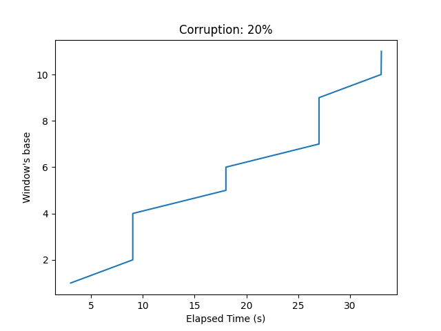

# TR2 - Trabalho Final

### Matrículas/Alunos:

- Edson de Souza Sales - 190105399
- Hyago Gabriel Oliveira Figueiredo - 170105067

### Clonar repo:

```
git clone https://github.com/25edson25/go-back-n.git
```

Em seguida mudar para a branch `gobackn`

## Objetivo

Trabalhar com uma arquitetura de rede em camadas e implementar funções que permitam uma melhor utilização do enlace utilizando técnicas de pipelining vistas no capítulo 4 (Camada de Transporte) do livro.
Seu trabalho é implementar o rdt_4_0, estendendo/modificando o código inicial fornecido (stop-and-wait) para que múltiplos pacotes possam fluir entre cliente e servidor.

Implementações possíveis:

- Go-back-N (mais simples)
- Selective Repeat (mais complexo, e por isso tem um bônus extra na nota final para o grupo que implementar de forma correta).

Após a execução/simulação, seu código deve fornecer as seguintes estatísticas:

- Vazão (camada de rede, incluindo cabeçalhos)
- Goodput (vazão na camada de aplicação)
- Total de pacotes transmitidos
- Total de retransmissões (para cada tipo de pacote utilizado)
- Total de pacotes corrompidos (para cada tipo de pacote utilizado)
- Tempo de simulação (tempo desde o início do envio até o último pacote enviado)
- O código deve permitir o envio de múltiplas mensagens entre o cliente e servidor. O número de mensagens deve ser definido como argumento de linha do cliente.

## COMO RODAR:

#### Utilizar os próximos comandos no root da pasta do trabalho

- Para rodar a parte 1 - Servidor:
  ```
    python3 Server.py 5000
  ```
- Para rodar a parte 2 - Cliente:

  ```
    python3 Client.py localhost 5000
  ```

  **IMPORTANTE QUE NÃO HAJA MUDANÇA NOS DIRETÓRIOS PARA UM BOM FUNCIONAMENTO DO PROGRAMA**

## Saída do Programa:

- **Implementação do Servidor:** Log das transações de recebimento dos pacotes, envios de ACKs contendo, também, a response MAIÚSCULA

- **Implementação para Cliente:** Resumo dos processos de envio
  dos pacotes, juntamente com o acompanhamento dos ACKs (somente diretos) enviados pelo servidor. Os textos em MAIÚSCULO também podem ser observados ao final, após a demonstração dos seguintes dados:
  - Total de pacotes transmitidos
  - Total de retransmissões
  - Total de pacotes corrompidos (para cada tipo de pacote utilizado)
  - Tempo de simulação (tempo desde o início do envio até o último pacote enviado)

## Explicação do código:

`Transmissão inicial:`
O emissor (sender) envia as mensagens sequencialmente. A janela de envio (send window) permite que até 4 segmentos sejam transmitidos ao mesmo tempo.

`Recepção no receptor:`
O receptor (receiver) recebe os segmentos.
O receptor confirma a recepção dos segmentos até um certo ponto, conhecido como próximo número de sequência esperado (expected sequence number).
Caso haja um pacote em duplicidade, o receptor envia o sequencial do pacote duplicado. Escolha feita para evitar o uso de ACKs cumulativos.

`Janela deslizante:`
O emissor mantém uma janela de envio que representa os segmentos que podem ser transmitidos.
A janela deslizante move-se conforme os ACKs (acknowledgments) são recebidos do receptor.

`ACKs positivos:`
Se o receptor recebe um segmento corretamente e está pronto para aceitar o próximo, ele envia um ACK positivo para o emissor.
O emissor desliza a janela para frente, permitindo o envio de mais segmentos. Não havendo ACKs cumulativos.
No emissor, em caso de ACKs não sequenciais, maiores que a base, as respostas são desconsideradas.

`ACKs negativos (NACKs):`
Se o receptor detecta um erro em um segmento recebido, ele deixa de enviar ACK para indicar que o segmento precisa ser retransmitido. _Não há NACK para a implementação atual_.
O emissor retransmite todos os segmentos na janela que não foram confirmados.

`Temporizadores:`
O emissor utiliza temporizadores para detectar a perda de pacotes. Se um ACK não é recebido dentro do tempo limite, o emissor assume que ocorreu um erro no pacote e retransmite os segmentos na janela.

```plaintext
Exemplo prático:
      Suponha que o emissor está enviando os segmentos de 1 a 4.
      Se o receptor recebe corretamente os segmentos 1 e 2, envia ACKs para 1 e 2, permitindo que o emissor deslize a janela para os segmentos 3 a 6.
      Se o receptor não recebe corretamente o segmento 3, não envia ACK para 3, e o emissor eventualmente retransmite 3, 4, 5 e 6.
```

O processo continua até que todos os segmentos tenham sido corretamente recebidos e confirmados pelo receptor.

## Resultados

A janela deslizante foi confirmada como uma abordagem eficiente para controlar a transmissão de dados e lidar com perdas, e corrupção, de pacotes em redes de comunicação. Como observado nos próximos gráficos:

|          _Vazão sem perda ou corrupção_           |
| :-----------------------------------------------: |
|  |

|          _Vazão com 10% de perda_           |
| :-----------------------------------------: |
|  |

|          _Vazão com 20% de perda_           |
| :-----------------------------------------: |
|  |

|        _Vazão com 10% de corrupção_         |
| :-----------------------------------------: |
|  |

|        _Vazão com 20% de corrupção_         |
| :-----------------------------------------: |
|  |

|       _Vazão com 10% de reordenação_        |
| :-----------------------------------------: |
|  |

|       _Vazão com 20% de reordenação_        |
| :-----------------------------------------: |
|  |

    Conseguimos observar que a solução se manteve estável quando deveria e, com o aparecimento de erros nos pacotes, a vazão realmente sofreu a alteração esperada. Lembrando que a representação gráfica da vazão (taxa de transferência) ao longo do tempo, considerando a presença de pacotes com erro, pode variar dependendo da intensidade dos erros.

Para acompanharmos o funcionamento de forma mais fácil, oberservêmos agora o comportamento da base da janela no tempo. Lembrando que cada nova movimentação da base significa que o pacote (frase) anterior foi enviado e recebido já em MAIÚSCULO com sucesso.

|      _`Sem erros ou corrupção:`_      |
| :-----------------------------------: |
|  |

|     _Com ocorrência de perda_     |
| :-------------------------------: |
|  |
|  |

|   _Com ocorrência de corrupção_   |
| :-------------------------------: |
|  |
|  |

|  _Com ocorrência de reordenação_  |
| :-------------------------------: |
|  |
|  |

Para os casos com algum tipo de erro, podemos ver um andamento mais gradual da janela a cada aumento da porcentagem de probabilidade. A solução se mostrou, ainda, muito eficiente em lidar com o aparecimento de anomalias. Resultando, sempre, numa comunicação estável, sem erros (falsos negativos) e que entrega as respostas como esperado.

## Indicações da plataforma utilizada:

- python3
- Sistema Operacional: Pop!\_OS 22.04 & Win11
- Ambiente utilizado para programar: Visual Studio Code
  - Live Share (extensão que auxilia o pair programming)
